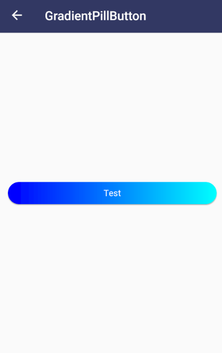
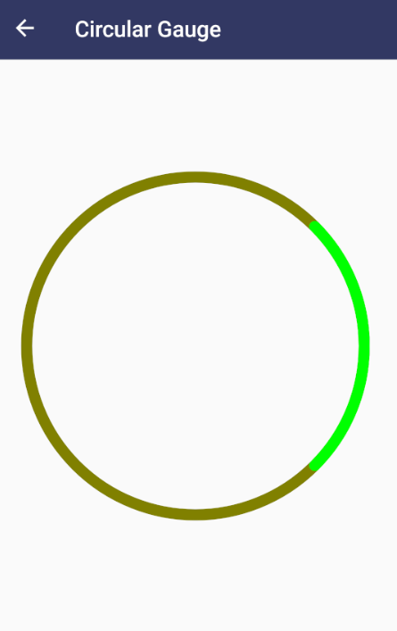

# Aurora Controls Playground

Xamarin.Forms sample to show the main [Aurora Controls](https://auroracontrols.app) features.

    

**NOTE**: _To use the sample, remember to add your keys in the AppSettings class._

## Copyright and license

Code released under the [MIT license](https://opensource.org/licenses/MIT).